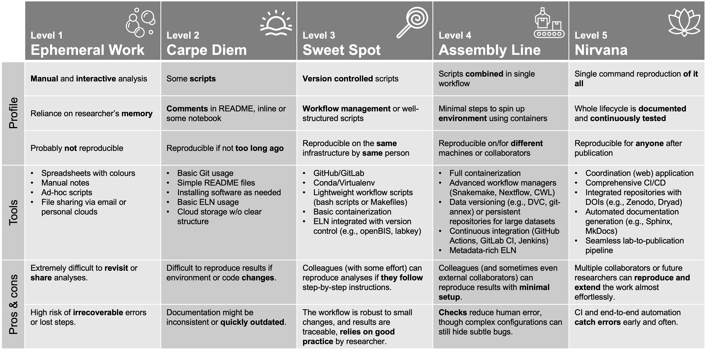

# Reproducibility Levels in Practice

_a humble attempt at levelling_

**Author:** Daniel J. Stekhoven, stekhoven@nexus.ethz.ch

**Date:** 2025-02-21

---

**Lead**

Reproducibility is sometimes seen as an added chore—a hurdle to jump after our main analysis is done. In reality, reproducible research can save us from costly mistakes, clarify our thought processes, and foster more collaborative science. By adopting a handful of best practices, we not only help others replicate our work but also streamline our own research and reduce frustrations.

I am interested in exploring the questions, whether we can find out where we as individual researchers stand with our own research, whether there is *enough* reproducibility, and whether it is actually worth the effort?

---

## Definitions of Reproducibility

### Some attempts at defining reproducibility and other R-words

#### Focusing on input data

According to the National Academy of Sciences in Engineering and Medicine[^1] **Reproducibility** is obtaining consistent computational results using the same input data, computational steps, methods, code, and conditions of analysis. **Replicability** is obtaining consistent results across studies aimed at answering the same scientific question, each of which has obtained its own data.

#### That issue with consistent results

Goodman et al.[^2] defined the "classical" reproducibility as **Methods Reproducibility** and rechristened replicability into **Results Reproducibility**. They also included a third level of reproducibility of results, which was **Inferential Reproducibility**. The latter one is achieved, if the results allow for qualitatively similar conclusions, which means the results can be numerically wiggly, but the significance structure remains the same.

#### Alternatively, focus on the reporting of different parts of the research

One could say that proper documentation and reporting thereof lies at the heart of reproducibility. Furthermore, different aspects of a research project requires reporting of different information. To that end Victoria Stodden[^3] identified three types of reproducibility: **Computational Reproducibility** depends on reporting on code, software, hardware, and implementation. **Empirical Reproducibility** deals with protocols, experiments, and materials, while **statistical reproducibility** is describing used tests, chosen parameters for models, and thresholds used in the statistical analysis.

#### The Four Horsemen of (Statistical) Irreproducibility

This is largely taken from Dorothy Bishop[^4] but well worth being repeated many times, so here we go:

1. **Publication Bias**
   The tendency for studies with “positive” or significant findings to be more likely published, while “negative” or null results remain unseen. This skews the literature and inflates the apparent importance of certain effects.

2. **Low Statistical Power**
   Conducting studies or experiments with too few participants (or observations), making it difficult to reliably detect true effects. Low-powered studies not only increase false negatives but also produce less stable effect size estimates.

3. **P-Hacking**
   Also known as “data dredging,” this involves trying multiple analyses or selectively reporting results in order to achieve statistical significance. It exaggerates the likelihood of false positives.

4. **HARKing** (Hypothesizing After the Results are Known)
   Presenting a hypothesis as if it were formulated before the study, when in fact it emerged after seeing the data. This practice inflates apparent confirmatory evidence and undermines the integrity of hypothesis testing.

#### Reproducibility in Genomics

Re-sequencing the same sample will yield different reads in a fastq file. Also, some bioinformatics tools can yield different results based on several computational aspects - for instance the ordering of reads in the fastq file or stochastic components in the tool itself. If appropriate steps are taken to mitigate these risks and the results are consistent with respect to their "genomic meaning", we can speak of **Genomic Reproducibility**.[^5]

### Bottomline

Reproducibility means that someone else (or a future version of ourselves) can re-run our analyses or experiments and arrive at the same results, using the same input data. This concept goes beyond just computational steps. It intersects with how we:

- Collect and document raw data;
- Use computational tools and workflows;
- Track different versions of code and data;
- Publish and share results in an open, accessible manner.

In practice, reproducibility doesn’t have to mean extra overhead or busywork. By applying a few structured habits and the right tools, the outcome becomes more robust, traceable, and easier to share. Getting to a meaningful level of reproducibility will, however, mean some initial work.

---

## The Holy Trinity of (Computational) Reproducibility

It is always nice to have priorities and even nicer, if there are three of them. So let's try to extract the three most important and general aspects to become reproducible (enough).

1. **Version Control** (e.g., git on platforms like GitHub/GitLab)  
   - Track and manage changes in your code, scripts, and configurations.  
   - Roll back to previous states and collaborate without overwriting each other’s work.

2. **Workflow Management** (e.g., Snakemake, Nextflow)  
   - Orchestrate your analysis steps so they run in a predictable, documented order.  
   - Makes rerunning or updating a portion of your pipeline straightforward.

3. **Containers** (e.g., Docker, Singularity)  
   - Package your environment—libraries, languages, tools—into a portable unit.  
   - Eliminates the “it works on my machine” problem by standardizing setups.

### The Lesser Trinity of (Computational) Reproducibility

Since some of you might point out that there is much more sublime (and fancy) stuff in true reproducibility, I also list here the lesser trinity...

1. **Data Management** 
   - Ensure large or raw data is consistently tracked and versioned.  
   - Provide metadata that describes how data was collected, formatted, and processed.

2. **Documentation**  
   - A thorough README, lab notebooks (electronic or otherwise), and inline code comments.  
   - The “why” behind your steps is as important as the “how.”

3. **Continuous Integration (CI)** (e.g., GitHub Actions, GitLab CI)  
   - Automatically test your code and workflows whenever changes are made.  
   - Catches mistakes early and keeps workflows in a consistently runnable state.

---

## The Five Levels of Reproducibility

I have tried to identify along the lines of the trinities five levels of reproducibility to allow a research to position themselves. Real people/groups often straddle multiple levels, but this model can help you see where you stand and where to aim. 

_Icons from https://www.flaticon.com/._

---

## Concluding Remarks

Reproducibility may start as a small change to daily habits—switching to Git, writing short scripts, or containerizing an environment. Over time, this foundation becomes a powerful framework that:

- **Reduces effort** in the long run by cutting down on guesswork.
- **Builds trust** within the research community and with collaborators.
- **Facilitates innovation** by making it easier to build on previous work.

No matter where you currently stand, taking steps toward a higher level of reproducibility often pays off—both for you and the broader scientific community.

---

## References

[^1]: Medicine, N. A. of S., Engineering, and. (2020). Reproducibility and Replicability in Science: Report Highlights. Harvard Data Science Review, 2(4). https://hdsr.mitpress.mit.edu/pub/nas-report-highlights

[^2]: Steven N. Goodman et al., What does research reproducibility mean? Sci. Transl. Med. 8, 341ps12-341ps12 (2016). DOI: https://doi.org/10.1126/scitranslmed.aaf5027

[^3]: Victoria Stodden, What scientific idea is ready for retirement?, Edge.org, (2016), https://www.edge.org/response-detail/25340

[^4]: Dorothy Bishop, Rein in the four horsemen of irreproducibility. Nature 568, 435 (2019). DOI: https://doi.org/10.1038/d41586-019-01307-2

[^5]: Baykal, P.I., Łabaj, P.P., Markowetz, F. et al. Genomic reproducibility in the bioinformatics era. Genome Biol 25, 213 (2024). https://doi.org/10.1186/s13059-024-03343-2

